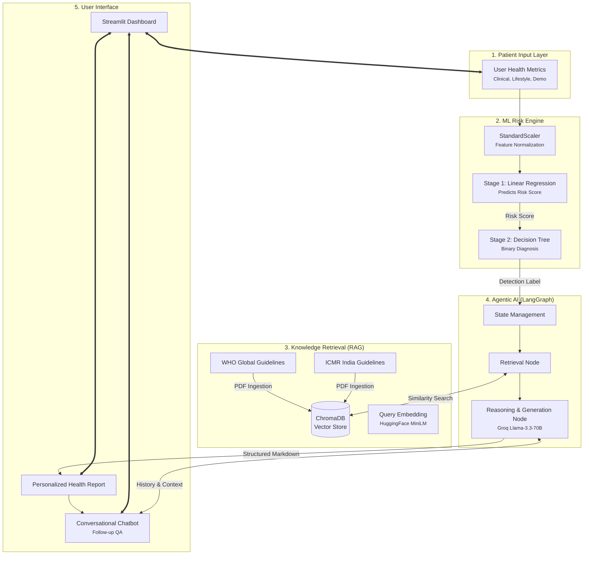

# Agentic Diabetes Risk Assistant 🩺🤖

A professional-grade, hybrid AI system that combines **Classic Machine Learning** with **Agentic RAG (Retrieval-Augmented Generation)** to provide highly accurate diabetes risk assessments and evidence-based health guidance.

## 🌟 Project Overview

This system evolves from a standard binary classifier into a sophisticated **Health Support Agent**. It operates in two primary phases:
1.  **ML Risk Prediction Engine**: A two-stage pipeline (Linear Regression + Decision Tree) that analyzes 24 clinical parameters to calculate a precise risk score (0-100) and a diagnostic label.
2.  **Agentic AI Reporting (RAG)**: A LangGraph-orchestrated workflow that retrieves localized medical guidelines from the **WHO** and **ICMR (Indian Council of Medical Research)** to generate personalized, medical-grade health reports.

## 🏗️ System Architecture



## 🚀 Key Features

- **Hybrid Prediction Pipeline**: Combines continuous risk scoring with discrete classification for a nuanced health perspective.
- **Evidence-Based RAG**: Unlike generic LLMs, this agent grounds its advice in official **WHO** and **ICMR** documents, citing sources directly.
- **Conversational Follow-ups**: A stateful chat interface allows users to ask clarifying questions about their report (e.g., "What does the ICMR say about my physical activity levels?").
- **Localized Context**: Specifically tuned with ICMR guidelines for Asian-Indian phenotypic risk factors.
- **Modern UI**: Implemented with glassmorphism aesthetics and responsive Streamlit components.

## 🛠️ Tech Stack

- **Orchestration**: LangGraph
- **LLM Engine**: Groq (Llama-3.3-70B-Versatile)
- **Vector Database**: ChromaDB
- **Embeddings**: Sentence-Transformers (`all-MiniLM-L6-v2`)
- **ML Frameworks**: Scikit-Learn, Pandas, NumPy
- **Frontend**: Streamlit + Custom CSS
- **Deployment**: Streamlit Community Cloud

## 📂 Project Structure

```text
├── data/                       # Raw clinical datasets
├── models/                     # Serialized ML models (Joblib)
├── milestone_1/                # ML Discovery & Local Prediction App
│   ├── app.py                  # Initial ML dashboard
│   └── style.css
├── milestone_2/                # Agentic AI & RAG Implementation
│   ├── app.py                  # Main Dashboard (Agentic/Chat)
│   ├── agent.py                # LangGraph definition & Nodes
│   ├── ingest.py               # Vector Database Ingestion script
│   ├── knowledge/              # Official Medical PDFs (ICMR/WHO)
│   ├── chroma_db/              # Persistent Vector Store
│   └── style.css               # Dashboard styling
├── requirements.txt            # System dependencies
└── README.md
```

## ⚙️ Getting Started

Follow these steps to set up and run the project locally.

### 1. Prerequisites
- Python 3.9 or higher
- A Groq Cloud account (for the LLM)

### 2. Installation

1.  **Clone the Repository**:
    ```bash
    git clone <repository-url>
    cd Capstone_ML
    ```

2.  **Create a Virtual Environment**:
    ```bash
    python -m venv venv
    source venv/bin/activate  # On Windows: venv\Scripts\activate
    ```

3.  **Install Dependencies**:
    ```bash
    pip install -r requirements.txt
    ```

### 3. Configuration

1.  **Environment Variables**:
    Create a `.env` file in the root directory and add your Groq API key:
    ```bash
    ```
    Edit `.env` and fill in your key:
    ```text
    GROQ_API_KEY=your_groq_api_key_here
    ```
    *You can get your API key from the [Groq Console](https://console.groq.com/keys).*

### 4. Running the Application

1.  **Ingest Medical Knowledge (First-time setup)**:
    This script converts the medical PDFs in `milestone_2/knowledge/` into a vector database.
    ```bash
    python milestone_2/ingest.py
    ```

2.  **Launch the Dashboard**:
    ```bash
    streamlit run milestone_2/app.py
    ```

## 🧪 Deployment

To deploy to **Streamlit Community Cloud**:
1.  Push your code to GitHub.
2.  Connect your repository to [share.streamlit.io](https://share.streamlit.io).
3.  In the Streamlit app settings, add `GROQ_API_KEY` under **Secrets**.

---
*⚕️ **Disclaimer**: This tool is for informational and educational purposes only. It is not a substitute for professional medical advice, diagnosis, or treatment. Always consult a qualified healthcare provider.*
