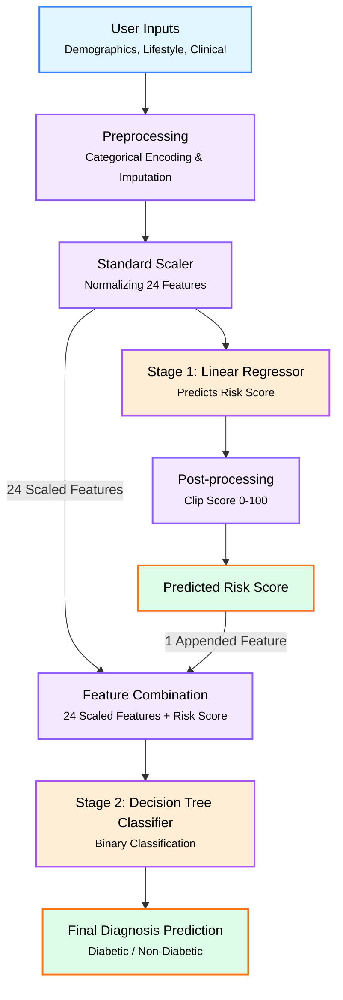

# Diabetes Prediction & Risk Analysis System

A full-stack Machine Learning application designed to assess diabetes risk and provide a binary diagnosis based on clinical, demographic, and lifestyle indicators. The system utilizes a **two-stage hybrid model** deployed via a user-friendly Streamlit interface.

## Project Overview

This project aims to provide an accessible tool for early diabetes detection. It analyzes 24 distinct health metrics to output:

1.  **Diabetes Risk Score (0-100):** A continuous value representing the user's predisposition to diabetes.
2.  **Diagnostic Prediction:** A binary classification (Diabetic / No Diabetes) with confidence intervals.

The workflow begins with raw data processing in a Jupyter Notebook, training optimized regression and classification models, and deploying them through an interactive web dashboard.

## Features

- **Interactive Web Interface:** Built with Streamlit, featuring a glassmorphism design and tabbed input layout.
- **Two-Stage Prediction Pipeline:**
  - **Stage 1 (Regression):** Predicts a continuous Risk Score.
  - **Stage 2 (Classification):** Uses the predicted Risk Score + original features to determine the final diagnosis.
- **Comprehensive Metrics:** Analyzes BMI, HbA1c, Glucose levels, Cholesterol, Sleep patterns, and Lifestyle choices.
- **Visual Feedback:** Color-coded risk indicators and confidence percentages.

## System Architecture



### Breakdown of the Flow:

1. **Inputs & Scaling**: The 24 clinical features from the user are gathered, encoded, and passed through the `StandardScaler` to ensure all numerical values exist on the same scale, a requirement for Linear Regression to perform well.
2. **Stage 1 (Risk Scoring)**: The scaled features are fed into our first model, the **Linear Regressor**, which outputs a continuous value. We clip this value between 0 and 100 to generate the **Predicted Risk Score**.
3. **Feature Combination**: We take the 24 scaled features and append the new `predicted_risk_score` to create a 25-feature array (or DataFrame).
4. **Stage 2 (Diagnosis)**: This combined dataset is passed into the **Decision Tree Classifier**, which uses the heavily weighted risk score alongside the core clinical metrics to make the final binary prediction (Diagnosed or Not Diagnosed).

## Confusion Matrix


## Tech Stack

- **Language:** Python 3.x
- **Machine Learning:** Scikit-Learn (Linear Regression, Decision Tree Classifier)
- **Data Manipulation:** Pandas, NumPy
- **Visualization:** Matplotlib, Seaborn
- **Deployment/UI:** Streamlit
- **Styling:** Custom CSS
- **Data Source:** Kaggle Hub API

## Project Structure

```text
├── app.py                         # Main Streamlit application entry point
├── Diabetes_Risk.ipynb            # Model training, EDA, and evaluation notebook
├── style.css                      # Custom CSS for UI styling
├── diabetes_prediction_models.pkl # Serialized ML models and Scaler
└── .gitignore                     # Git configuration
```
